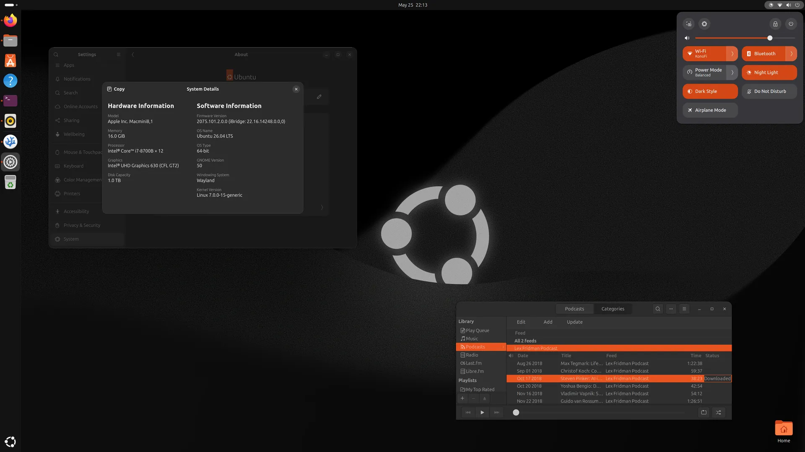

# Choosing a Linux Distro

It's always exciting looking for a GNU/Linux distribution. Every other day there is a new one around the corner seemingly. Most of them are derivatives, sure; others are simply customized/optimized versions of existing distros with emphasis in one area (productivity, gaming). For my purpose I need to go by hardware support first.

## Two Hardware Requirements

* Mac Mini 2018 with Intel CPU, but also T2 Security Chip
* Dell 32" 4K Display (meaning, support for HiDPI)

A low priority third requirement would be my wireless Dell KB/MS. I use the same monitor and peripherals for work to minimize clutter, so I will be using this also. I do not have any doubt it would work; would just be nice to have the multimedia buttons and shortcuts work also.

The first restriction leads me to [T2 Linux](https://wiki.t2linux.org/) - an amazing collection of resources to install Linux on Intel-era Macs with T2 chip. The volunteers behind this project maintain popular distributions with the necessary modifications and list steps to get proprietary firmware out of the macOS partition (or from a downloadable image) to get the right modules working. For me, this list shows which distros are likely to have good support to begin with. The usual suspects are there, Ubuntu, Mint, Fedora, Arch.

NOTE: After trying out a couple of the custom images I found out the only thing I really needed for my Mac Mini was the WiFi/Bluetooth firmware installation script when compared to the official ISOs. Everything else worked out of the box.

The HiDPI requirement is next. Both flagship desktop environments, GNOME and KDE Plasma, have completed their migration from X11 to Wayland and support fractional scaling. This means I can have a pleasant experience with crisp windows and fonts at 4K resolution with 150% zoom factor - exactly the same as my macOS (and Windows corporate laptop also).

## Narrowing Down the Options

After catching up on multiple unfamiliar names from [Distro Watch](https://distrowatch.com/) and reading blog posts and reviews about them, I decided to go back to what was familiar. The shortlist looked like this:

* Debian 13.X - the one almost everything else on the list is based on; known for its stability and strong FOSS values; I knew I would violate that contract the minute I needed macOS firmware for the Broadcom chip so I thought let me use something else for now and explore Debian later.
* Linux Mint 22.X - this was my first choice back in the day and an amazing distribution all around; with GNOME moving to GTK4 and Cinnamon/Mate being GTK3/2-based, there are some inconsistencies in app looks these days unfortunately.
* elementaryOS 8.X - the Linux version of macOS as far as UI goes; a very elegant distribution overall, but development seems to have slowed down so I was concerned about stability issues mainly.
* Ubuntu 26.04 - the standard option; good timing on latest LTS release also. Unity DE has multiple critics but I think it strikes a decent balance between classic menus and modern GNOME paradigms; Just don't bring back that 12.04 Amazon integration please...
* Fedora 44 - the de facto Vanilla GNOME experience; I tried 42 a few months ago and it was just beautiful but with a few bugs; this was almost my first choice.
* KDE Neon - the latest KDE on top of an Ubuntu LTS base; I also tried this a few months ago and was equally impressed by how polished it looked; KDE Connect is a fantastic smartphone companion app also.
* Kubuntu 26.04 - a more reserved KDE experience but still plenty modern and a long running project; presumably a very stable choice (I never got to install it)

## GNOME and KDE

The two most commonly found Desktop Environments also carry with them a deep OS integration, underlying libraries, a design philosophy and a suite of apps. For my purposes it does not really matter which one I choose. They both have plenty of apps for what I need. 

In the end I decided GNOME would be more useful for my experiment, as it focuses mostly on simple interfaces and distraction-free approach. I do get distracted easily, so I wanted to prevent myself from fiddling too much with the numerous KDE settings.

## The Final Choice, For Now...

I chose to go with Ubuntu 26.04. I was also mistaken, it does use default GNOME and not Unity for several years now. Could've tricked me... Anyway, it felt like the right choice. Vanilla GNOME can be a bit too much in terms of mental models. Usually a couple plugins and tweaks are needed to improve usability. Ubuntu bridges that gap nicely by default. If this journey takes me further than simple exploration, I can always install another OS down the line.

Installation was a breeze. Almost everything worked out of the box. I plugged my mac mini via ethernet port on my router to get the T2 firmware installation script going and after that I had WiFi and Bluetooth working also. Screen resolution was set automatically to 4K and scaling at 150% looks fantastic. Night light works and has been a built-in feature for some time (shoutout to Redshift for enabling this in the old days). Dark mode is also available and the OS comes with light & dark versions of the same wallpaper to keep things aligned. Overall this is as polished as it gets. Very impressed. All the multimedia buttons and shortcuts on my keyboard also work - a small win, but adds convenience without a doubt.

The one thing I noticed not detected is the built-in mac mini speaker. That glorious 2W (I think that's correct) speaker that serves only to scare you with that "Ahhhh" noise that Macs make on boot. That's it. I'm abandoning the experiment...

