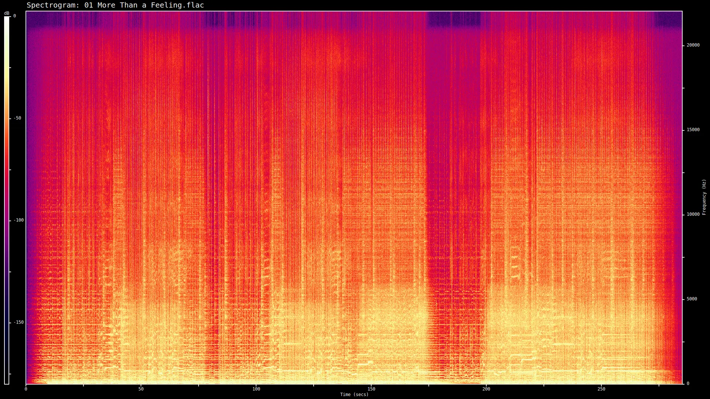
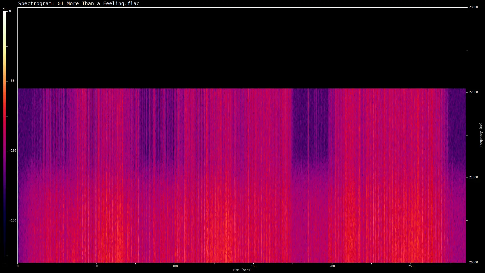

# Exploring The Music Landscape

Going into this, I already have a partial idea of what to expect and where to look, but I am curious to find out the things I'm not aware of.

## Audio Requirements

Plainly put, CD audio quality in digital format is what I'm after. I don't need something of extreme dynamic range but I would also rather skip lossy formats if possible. These are meant to be one time purchases that will last. That being said, a 16-bit 44.1kHz FLAC is the sweet spot. 

The main intention is to play them from local SSD, so 30-40MB per song is not an issue. In the past I have used Subsonic on a personal server / NAS, which I might do again. If I remember correctly on-the-fly transcoding is possible there, so I don't have to worry about having a "storage format" and a separate "streaming format".

## Digital Music Stores

From a quick search and also AI-assisted research, there are several online stores selling digital music in CD-or-above quality. This is excellent news. 

Here is a quick breakdown from what I've found:

* **Bandcamp** | Still going strong. The most artist-oriented option as far as royalties and compensation goes. It is also the exception on the lists since they don't technically sell content directly themselves, they allow artists to create their online store through which content is purchased. A second notable exception is the fact that stores can operate in their native country's currency.
* **Qobuz** | A solid option with big catalog; they also seem to offer streaming plans, accompanying applications and more; good to know, though I am only interested in their direct purchase & download offerings.
* **Bleep** | Focused on specific genres, so smaller overall catalog, but a welcoming find; I do actually like some of the music they offer, so this automatically becomes an alternative to Bandcamp for electronic, trip-hop and such.
* **7Digital** | Very large catalog, and probably the place I'll hunt down some classic rock and blues records; I did see a few complaints online about their customer support, which means some issue on the content itself; I won't know until I try it I guess.
* **HDtracks** | A heavy weight in hi-res offerings; from a quick glance, they are really true to their name; so many 24-bit 96kHz albums, and even 352.8Khz ones! Kudos to them for catering to the audiophiles, but I don't think I will be purchasing from here often or at all; the hi-res comes at a hi-price and I would not be able to tell the difference. Nevertheless, will bookmark it.

Just for completeness, Apple sells digital music via iTunes in AAC 256kbps and Amazon via Amazon Music in MP3 320kbps, both DRM-free. This is plenty good quality for everyday listening (regardless of what the endless online debate says) but I have already spent so much money on those two companies in subscriptions I'd rather not purchase from them while there are better alternatives available.


## Let's Get Some Albums

This is the fun part! My first instinct is to get all the stuff I automatically reach for when I don't want to look up music, Dire Straits, Iron Maiden, Guns N' Roses, the works... Then I step back thinking I should probably diversify for this first round, there's so much more music I like.

Looking at my Bandcamp account, I have just one downloadable album - Let's Get Out of This Country by Camera Obscura - and a few ambient albums (CBL, Solar Fields, Sync24) that are locked, which is strange. I did reach out to the corresponding account (Ultimae) but I'm not really expecting much. These are purchases from 2014 and it seems that ownership might've changed. Well, I still have one at least, and it's a good album.

Looking at the online stores, a couple of things stand out immediately:

* Miles Davis was born 100 years ago, so his music is being especially celebrated this year; It is an opportunity to explore his work; I have only heard bits and pieces over the years. An internet search tells me Kind of Blue is a good choice. I'm sure there's many more, but one is enough to get started. Qobuz sells this.
* Boards of Canada is releasing a much anticipated new album (Inferno) after 13 years! In a funny coincidence, I have not listened to their music since around that era 2013/2014, so this goes in the list also. I was under the impression I had some of their older albums, but if I did, those have completely disappeared from my Bandcamp account. Need to circle back on this.

I decide to add two albums that I've listened to from start to finish multiple times, bringing the total to 5!

* Boston (1976) by Boston
* Yours Truly, Angry Mob (2007) by the Kaiser Chiefs

This is a good start, some familiar stuff, some new. I'm curious to see what the actual downloads looks like next in terms of packaging, metadata and anything extra.

### BandCamp

- Download Type: ZIP, named as `Artist - Album.zip`
- ZIP Contents: Album folder with same name
- Album Folder Contents: Songs in FLAC format and the album cover as JPG
- Songs Metadata: 
  - Present: Title, Album, Artist
  - Missing: Composer, Genre, Total Track Count and BPM
  - Comment indicates the artist's Bandcamp store URL

Notes: pretty straightforward overall and a fast download; I would guess this is sitting on a server exactly as a ZIP ready to be downloaded. A few metadata fields missing.

### Qobuz

- Download Type: ZIP, named as `<hash>.zip`
- ZIP Contents: Folder with the same hash ID and inside the actual album folder with 'Artist - Album' naming convention
- Folder Contents: Songs in FLAC format (no album cover, but can be downloaded separately)
- Song Metadata: 
  - Present: Title, Album, Artist, Composer, Genre, Total Track Count and Cover
  - Missing: BPM
  - Comment is also empty

Notes: downloads are on demand it seems and the ZIP archive needs to be generated upon request; as a result the actual download contains some generated hash ID instead of the artist and album name. Minor inconvenience I would say, unless downloading many albums at once which would require some script instead of chasing folders one by one with the mouse.

Another thing I noted was the mixed album art on the songs themselves - the Boston album had nothing, the Kaiser Chiefs album loaded the correct one somehow and the Miles Davis album has a different cover than the one on the purchase (looks like original). I renamed all the cover JPGs into `cover.jpg`, same as Bandcamp, and that seemed to help at least in Rhythmbox. Again, just observations, not a big deal.

## Verification Time

I don't want to blindly trust the content is true to its format and audio quality, but I do need a verification methodology in place. Two actually, a visual one for quick check and an automated one to run against each album.

### Method #1: Manual Inspection

For a quick spot check, I just need a spectrogram conversion tool to ensure the audio file contains frequency values all the way up to 22.05kHz. The raw audio from the studio could potentially capture higher frequencies as well, so this should look like a hard cut off, not a few coincidental values up there. Lossy formats typically cut at 16kHz-20kHz to reduce file size instead.

I tried using [spek](https://www.spek.cc/) which I have used in the past. Unfortunately, even though the installation worked (as a snap package) there is an error upon launching it that the underlying GTK2 libraries are not compatible with Wayland.

I found a command line tool `sndfile-spectrogram` of `sndfile-tools` package that does the job nicely however. Checking 'More Than A Feeling' by Boston, the default spectrogram shows clearly frequencies above 20kHz. Hooray!



I could not figure out how to add markers in the right Y-axis, so here is a zoomed version with only 20kHz-23kHz. With a bit of eye squinting, the cutoff is indeed at 22.05kHz.



The sampling looks good. But we also need to ensure the data density is correct also. I think I have all the data to calculate this, but I check online to make sure.

* Multipliying everything out will give the capacity for a single channel raw file: `((16b * 44100Hz * 285sec) * 1B/8b) = 24MiB`
* For a stereo (2 channels) file, this is doubled, so say 48MiB.
* The actual file size on disk is 35MiB, which sounds reasonable assuming two channels and accounting for FLAC compression
* In a sense, for average length tracks (5 mins) and at the target quality, I should expect files no larger than 50MiB

### Method #2: Automated Inspection

There has to be some FFMpeg magic out there to make this easier. Otherwise, Python + NumPy can probably do the work. I ask Claude to provide a swift solution. It takes a couple iterations, but the end result looks great. Here is a Claude provided summary of what the script does:

```
  - Accepts one or more FLAC files as arguments; groups output by parent directory in a tree-style layout
  - Verifies stream properties (sample rate, bit depth, channel count) against a configurable target spec (default: 44100 Hz / PCM_16 / stereo)
  - Checks FLAC comment tags for completeness: title, artist, album, date, tracknumber
  - Computes a Short-Time Fourier Transform (STFT) over the first 60 seconds of audio, taking the peak magnitude per frequency bin across overlapping windows — this matches how spectrum analyzers like Spek render spectrograms
  - Uses the peak spectrum to find the highest frequency with energy above −65 dB relative to the spectral peak, reported as the effective cutoff frequency
  - Tri-zone verdict per file based on cutoff: ≥21 kHz → ok, 20–21 kHz → warn (possible 320 kbps upsampled source), <20 kHz → fail (likely upsampled lossy)
  - Exits with code 0 (all ok), 2 (warnings only), or 1 (issues found) for scripting
```

And here is what my tiny collection results look like:

```
────────────────────────────────────────────────────────
 Target: 44100 Hz · PCM_16 · 2ch stereo
────────────────────────────────────────────────────────

 Boards of Canada - Inferno (pre-order)/
 ├─ Boards of Canada - Inferno - 01 Introit.flac  ! bit depth PCM_24 (expected PCM_16)
 └─ Boards of Canada - Inferno - 02 Prophecy At 1420 MHz.flac  ! bit depth PCM_24 (expected PCM_16)

 Boston - Boston/
 ├─ 01 More Than a Feeling.flac  ok
 ├─ 02 Peace of Mind.flac  ok
 ├─ 03 Foreplay Long Time.flac  ok
 ├─ 04 Rock & Roll Band.flac  ok
 ├─ 05 Smokin'.flac  ok
 ├─ 06 Hitch a Ride.flac  ok
 ├─ 07 Something About You.flac  ok
 └─ 08 Let Me Take You Home Tonight.flac  ok

 CAMERA OBSCURA - Let's Get Out Of This Country/
 ├─ CAMERA OBSCURA - Let's Get Out Of This Country - 01 Lloyd, I'm Ready To Be Heartbroken.flac  ok
 ├─ CAMERA OBSCURA - Let's Get Out Of This Country - 02 Tears For Affairs.flac  ok
 ├─ CAMERA OBSCURA - Let's Get Out Of This Country - 03 Come Back Margaret.flac  ok
 ├─ CAMERA OBSCURA - Let's Get Out Of This Country - 04 Dory Previn.flac  ok
 ├─ CAMERA OBSCURA - Let's Get Out Of This Country - 05 The False Contender.flac  ok
 ├─ CAMERA OBSCURA - Let's Get Out Of This Country - 06 Let's Get Out Of This Country.flac  ok
 ├─ CAMERA OBSCURA - Let's Get Out Of This Country - 07 Country Mile.flac  ok
 ├─ CAMERA OBSCURA - Let's Get Out Of This Country - 08 If Looks Could Kill.flac  ok
 ├─ CAMERA OBSCURA - Let's Get Out Of This Country - 09 I Need All The Friends I Can Get.flac  ok
 └─ CAMERA OBSCURA - Let's Get Out Of This Country - 10 Razzle Dazzle Rose.flac  ok

 Kaiser Chiefs - Yours Truly, Angry Mob/
 ├─ 01 Ruby.flac  ok
 ├─ 02 The Angry Mob.flac  ok
 ├─ 03 Heat Dies Down.flac  ok
 ├─ 04 Highroyds.flac  ok
 ├─ 05 Love's Not A Competition (But I'.flac  ok
 ├─ 06 Thank You Very Much.flac  ok
 ├─ 07 I Can Do It Without You.flac  ok
 ├─ 08 My Kind Of Guy.flac  ok
 ├─ 09 Everything Is Average Nowadays.flac  ok
 ├─ 10 Boxing Champ.flac  ok
 ├─ 11 Learnt My Lesson Well.flac  ok
 ├─ 12 Try Your Best.flac  ok
 └─ 13 Retirement.flac  ok

 Miles Davis - Kind Of Blue/
 ├─ 01 So What.flac  ! frequency cutoff ~19982 Hz — likely upsampled lossy source
 ├─ 02 Freddie Freeloader.flac  ok
 ├─ 03 Blue in Green.flac  ? frequency cutoff ~20747 Hz — borderline, possible 320kbps upsampled; inspect with Spek
 ├─ 04 All Blues.flac  ok
 └─ 05 Flamenco Sketches.flac  ok

────────────────────────────────────────────────────────
 38 file(s) — 3 issue(s), 1 warning(s)
 ! Boards of Canada - Inferno - 01 Introit.flac: bit depth PCM_24 (expected PCM_16)
 ! Boards of Canada - Inferno - 02 Prophecy At 1420 MHz.flac: bit depth PCM_24 (expected PCM_16)
 ! 01 So What.flac: frequency cutoff ~19982 Hz — likely upsampled lossy source
 ? 03 Blue in Green.flac: frequency cutoff ~20747 Hz — borderline, possible 320kbps upsampled; inspect with Spek
────────────────────────────────────────────────────────
```

Notes:

* The Inferno album is offered in 24-bit instead of 16-bit
* The Miles Davis ones are tricky:
    * They are old recordings to begin with so that could be a reason
    * The spectrogram for both flagged tracks looks correct to me however
    * Given only 2 out of the 5 tracks got flagged, it seems unlikely they are selectively upsampled

This just shows some enhancements are needed probably in the calculation.

## Experiment Conclusion

As expected, purchasing DRM-free music online at a CD-or-above quality is indeed very possible. Bandcamp as a first choice then Qobuz, Bleep and 7Digital for everything not on Bandcamp or HDTracks for really high fidelity audio (not my target though).

This approach can be complementary to the monthly subscription me and so many others have to Apple Music or Spotify or even a viable alternative. I will say though, besides ownership, the gain here is intentionality and presence of mind more than anything. Spending time browsing albums, previewing them, learning about the artists and then purchasing. It feels right and it feels good. Streaming services are not geared towards that. They have tons of info and metadata, but you always have to navigate through their UI, recommendations, new releases, radio stations, playlists and more. Two different things.

Anyway, I learned a lot going through this process. Now I'll wait for the rest of the Inferno album to be released so I can listen to it from start to finish. Then I should probably look for some music player apps besides the trusty Rhythmbox which I installed. I'm curious what's new out there.