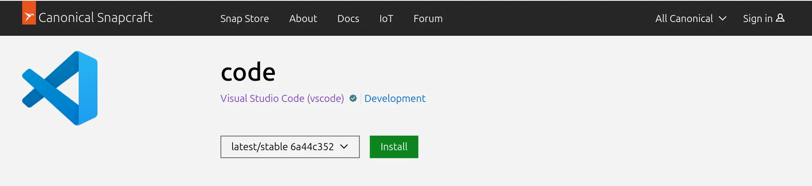
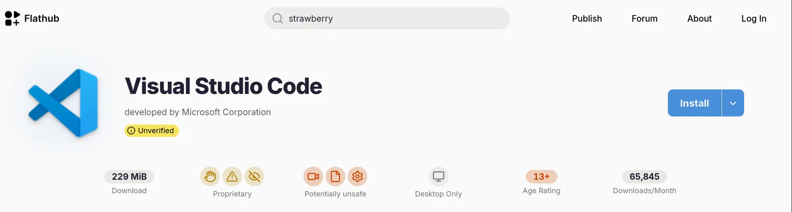

# Distro Hopping Already

At the beginning of this experiment I decided to use Ubuntu 26.04 LTS as a safe choice. A bit of custom GNOME (in a good way) but pretty standard otherwise I thought. I did not know about the entire application packaging modern conflict that's going on however in the Linux world and that was a bit off putting.

## Snap VS Flatpak

I came to find out that somewhere along the way, Canonical (the company behind Ubuntu) was investing into a packaging technology called `snap` for their Ubuntu Core distribution. That worked well enough to make it their preferred mechanism over `.deb` on their regular Desktop & Server to some extent. So Firefox for example is installed as a snap package on Ubuntu. It all works great, but snap packages are controlled by Canonical alone, no one else can contribute.

As a result, a competing implementation emerged with the backing of Red Hat, GNOME and others, called `Flatpak`. More or less the same idea at a high level, but in comparison this one is aligned with FOSS standards and allows everyone to package their application accordingly which allows for easy distribution and also up to date packages of course.

I was not aware of the above at all. I had seen `snap` and `snapd` pop up into Ubuntu installations at work over the years but working mostly remotely on Linux systems I had not paid much attention. I had no need to install a music player for example. So as I was exploring media players and just Linux applications in general for my experiment I came to realize the Ubuntu Software Center did not have any of the apps I was browsing on [GNOME Apps](https://apps.gnome.org/) because of the above.

So an Ubuntu distribution with GNOME desktop environment does not provide an out-of-the-box way to install GNOME Apps. Amazing...

To be fair, enabling flatpak runtime environment and adding the [Flathub](https://flathub.org) store only takes a couple commands, but you do end up having a separate GNOME Software application as a result, which is not exactly streamlined. Then I found myself thinking how should I choose between a package that is available in both places perhaps like Firefox? Should I uninstall the snap and install the flathub one? Does the system know I'm doing this or will it not update as a result? There are in the end technical differences between the two approaches, and there are known issues with apps that require certain levels of access due to the sandboxing nature of both.

Looking at VS Code for example on Snapcraft and Flathub two very different perspectives are formed:

* VS Code is marked as a trusted publisher on Snapcraft, but unverified on Flathub. 
    * Does this mean anything in practice or is it just a formality never completed?
    * Also how come the publisher is not Microsoft on both?
* The flathub package is a lot more explicit about the application in question and provides ample data
    * This is fantastic. All the information at a glance
    * My one nag is the safety disclaimer (in this case "potentially unsafe"). Clicking on that it essentially shows permissions that the app requests, not whether it passed a virus scan of sorts. This to me is a bit misleading, especially as I browse other packages and find out most applications are indeed deemed "unsafe", due to the fact that they require some local access, some network access, some device access and so on. The only "safe" ones, are essentially those who are self-contained applications, such as small games. So, yes I appreciate the transparency very much, but it is a bit deterring. Even GNOME's Text Editor is "Potentially Unsafe" so not sure how to feel about that.

*While on the VS Code example, I should mention I did install VS Codium as both a snap and flatpak and found the toolbar to be unresponsive. It would basically take 5-8 clicks to activate any menu and then disappear. What a bug... Apparently there is some incompatibility in Electron apps and Wayland. VS Code however worked fine. Not sure what to do with this info, just more obstacles I guess.*

From the above I am thinking I don't want to deal with this duality. If everything worked as a snap, I'd just use that, but since all the cool recent apps seem to be only available in flatpak format (at least for the time being) then I do have to use that instead. So I'm thinking the easiest way forward would be to switch to Kubuntu; same Ubuntu base but typically KDE is more application-complete out of the box, so I won't need to install much for my experiment. My other thought is to try out something that only uses flatpak like Fedora or Mint or Elementary OS.

## Trying Out Kubuntu 26.04

Just like with Ubuntu, installation was a breeze and everything looked great out of the box. I made sure to back up my Broadcom firmware prior to the switch so I could restore that and get WiFi working right from the start. It all worked great.

KDE Plasma 6.3 is not the latest as of this writing (6.7 is) but it still looks amazing. HiDPI support is evident, everything renders beautifully, corners are crisp. So I set up my environment and copy over my 5 albums. My assumption was correct. Out of the box you get Elisa, a very capable music player, Kate text editor for all text needs and Okular which is just about the most powerful document viewer.

It just doesn't feel right though... KDE applications are very powerful but also very busy looking. Opening up Kate, I cannot concentrate on the content. By default it doesn't even retain my project folder, so I have to keep re-opening it. Then I try to add a new blog post from the terminal and the file doesn't even show on my directory tree where I expected it to be - I find out later that it goes under "Untracked" because at that point I am not tracking it in git yet. It's a design choice I guess from the devs once a `.git` is detected.

At this point, I am fighting a paradigm shift more than anything. At another time, I might come back to KDE and spend some time to customize it and simplify it a bit to match my needs. Right now, I don't really have the patience for it. If I'm installing a long-running distro I expect certain things to work without tweaking.

I could always go to Fedora next. By most accounts, it is the best way to get vanilla GNOME experience, which I think is what I want. After trying out some of the GNOME apps on Ubuntu (via flatpak) however, and after experiencing some strange behaviors with system-apps like Disks, and the file manager not allowing me to write to my own USB storage, I'm thinking I can make another stop first.

## Trying Out Elementary OS 8.1

Elementary is a much smaller distro compared to Ubuntu and Fedora, but their design choices have always appealed to me. I am likely biased as a Mac user, but I would say that I like Linux Mint equally, as a Windows user. Two distros with different goals, but ultimately providing a simple and pleasant environment using traditional workflows (whether original or inspired by existing computing paradigms).

The installation is finicky. The installer failed continuously due to an EFI partition error. I manually emptied the disk using GParted but it didn't work. I manually created partitions for the installation but that didn't work either, it kept complaining about the EFI being too small (it asks for 256MiB and I tried that as well as 512MiB). It turns out there is a known bug in the installer miscalculating the partition size. So I had to allocate 4GiB to get it to pass. It doesn't bother me for what I need it for, but this needs to be resolved. That partition will occupy only a few MBs.

The installer proceeds normally after that and I am able to restore the Broadcom FW and get WiFi working as well. My display is set at 4K resolution with 150% scaling and everything looks good. The Pantheon environment is immediately comfortable and the default fonts and colors are pleasant. The included apps provide basic functionality and I can install others (via flathub) as needed. I am writing this on Code (the text editor) and I have already a wish list and items that need enhancement, but it doesn't bother me. This is a tiny team when compared with GNOME or KDE so my expectations are different.

It is possible I am enjoying some of the simpler GTK3-based designs also. With migration to GTK4 and the expected release of Elementary OS 9 in the near future I will have to revisit this. For now, I'll stay here and make the most of it.

## In Conclusion

I have some catching up to do with regards to modern packaging approaches. From a user experience, it seems to me one of the best Linux features (a package manager) is now unfortunately fragmented and the reasons are not apparent. I've decided to go with the flatpak approach for now to at least only manage one unknown (snap being the other), and I've moved from Ubuntu to Elementary to enjoy something that is neither GNOME nor KDE.

I should say, even though I am a bit critical of OS and Apps above, I have a lot of respect for everyone contributing to open source, whether through their free time or their employer. We all stand to benefit from those efforts collectively, and for that I am grateful.
